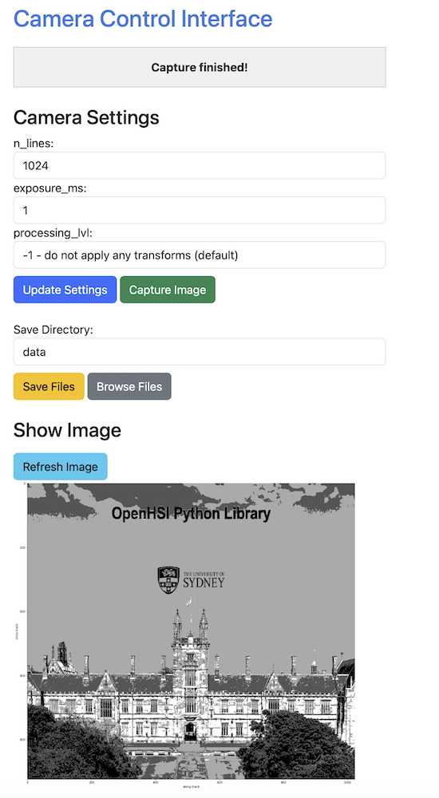

# Simple Web Controller for OpenHSI

A Flask-based web interface for controlling and managing OpenHSI hyperspectral cameras. This package provides a complete web application with RESTful API, real-time capture monitoring, and systemd service integration.



## Features

- **Web Interface**: Modern Bootstrap-based UI for camera control
- **RESTful API**: Complete API with Swagger documentation 
- **Real-time Monitoring**: Live capture progress and status updates
- **File Management**: Browse, view, download, and delete captured files
- **Configuration Management**: YAML-based configuration system
- **Systemd Integration**: Easy service installation and management
- **Installable Package**: Standard Python package with CLI entry point

## Installation

### Prerequisites

- Python 3.10+
- OpenHSI camera drivers and calibration files
- Conda/Mamba environment (recommended)

### Install from Source

```bash
# Clone the repository
git clone <repository-url>
cd simple-web-controller

# Create and activate conda environment
mamba create -n openhsi python==3.10 openhsi flask
mamba activate openhsi

# Install the package in development mode
pip install -e .
```

### Install from PyPI (when available)

```bash
pip install simple-web-controller
```

## Configuration

Create a `config.yaml` file with your camera and server settings:

```yaml
# Camera calibration paths
camera:
  json_path: "/path/to/camera_settings.json"
  cal_path: "/path/to/calibration.nc"
  default_settings:
    n_lines: 512
    exposure_ms: 10
    processing_lvl: -1

# File operations
files:
  data_directory: "/data"
  default_save_directory: "/data"

# Server settings
server:
  debug: false
  threaded: true

# Logging
logging:
  max_log_messages: 100
```

## Usage

### Running the Server

```bash
# Run with default config.yaml
simple-web-controller

# Run with custom config
simple-web-controller --config /path/to/config.yaml

# Run on different host/port
simple-web-controller --host 0.0.0.0 --port 8080

# Enable debug mode
simple-web-controller --debug
```

### Web Interface

Access the web interface at:
- **Main Interface**: `http://localhost:5000`
- **API Documentation**: `http://localhost:5000/api/apidocs`
- **File Browser**: `http://localhost:5000/browse/`

### API Endpoints

See dummy swagger ui https://openhsi.github.io/simple-web-controller/

## Systemd Service Management

### Install Service

```bash
# Install with default settings
simple-web-controller install-service

# Install with custom configuration
simple-web-controller install-service \
  --config /opt/config.yaml \
  --working-directory /opt/simple-web-controller \
  --user openhsi \
  --host 0.0.0.0 \
  --port 5000 \
  --start
```

### Manage Service

```bash
# Check service status
simple-web-controller service-status

# Manual service control
sudo systemctl start simple-web-controller
sudo systemctl stop simple-web-controller
sudo systemctl restart simple-web-controller

# View logs
sudo journalctl -u simple-web-controller -f

# Uninstall service
simple-web-controller uninstall-service
```

## Nginx Reverse Proxy Setup

For production deployments, it's recommended to run the application behind an nginx reverse proxy for better performance and security. this allows access via port 80 (i.e as standard web page, http://localhost).

### Install Nginx

```bash
# Ubuntu/Debian
sudo apt update
sudo apt install nginx

# CentOS/RHEL
sudo yum install nginx
# or
sudo dnf install nginx
```

### Configure Nginx

1. **Create nginx configuration file:**

```bash
sudo nano /etc/nginx/sites-available/simple-web-controller
```

2. **Add the following configuration** (based on `assets/openhsi.ngnix`):

```nginx
server {
    listen 80;
    server_name _;  # Replace with your domain or IP address

    location / {
        proxy_pass http://127.0.0.1:5000;
        proxy_set_header Host $host;
        proxy_set_header X-Real-IP $remote_addr;
        proxy_set_header X-Forwarded-For $proxy_add_x_forwarded_for;
        proxy_set_header X-Forwarded-Proto $scheme;
    }
}
```

3. **Enable the site:**

```bash
# Create symbolic link to enable the site
sudo ln -s /etc/nginx/sites-available/simple-web-controller /etc/nginx/sites-enabled/

# Remove default site
rm -r /etc/nginx/sites-enabled/default

# Test nginx configuration
sudo nginx -t

# Restart nginx
sudo systemctl restart nginx
sudo systemctl enable nginx
```

### Production Configuration

For production, configure the application to bind to localhost only:

```bash
# Install service to bind to localhost
simple-web-controller install-service \
  --host 127.0.0.1 \
  --port 5000 \
  --start
```


## Development

### Project Structure

```
simple-web-controller/
├── pyproject.toml              # Package configuration
├── requirements.txt            # Dependencies
├── config.yaml                # Default configuration
├── simple_web_controller/      # Main package
│   ├── __init__.py            # Package initialization
│   ├── cli.py                 # Command line interface
│   ├── server.py              # Flask application
│   ├── systemd.py             # Systemd service management
│   ├── templates/             # HTML templates
│   └── static/                # CSS/JS assets
├── assets/                    # Documentation assets
└── docs/                      # API documentation
```

### Development Setup

```bash
# Install in development mode with dev dependencies
pip install -e ".[dev]"

# Run tests (when available)
pytest

# Code formatting
black simple_web_controller/
flake8 simple_web_controller/
```

## Camera Settings

The interface supports both basic and advanced camera settings:

### Basic Settings
- **n_lines**: Number of scan lines to capture
- **exposure_ms**: Exposure time in milliseconds  
- **processing_lvl**: Data processing level (-1 to 4)

### Advanced Settings
- **row_slice**: Range of rows to read from detector
- **resolution**: Image resolution [height, width]
- **fwhm_nm**: Spectral resolution in nanometers
- **luminance**: Luminance value for calibration
- **binxy**: Binning factors [x, y]
- **win_offset**: Window offset [x, y]
- **win_resolution**: Window resolution [width, height]
- **pixel_format**: Pixel format (Mono8, Mono12, Mono16)

## File Management

The web interface includes a built-in file browser for managing captured data:

- **Browse directories** recursively from the data folder
- **View images** directly in browser
- **Download files** individually
- **Delete files** with confirmation
- **Navigation breadcrumbs** for easy directory traversal

## Troubleshooting

### Common Issues

1. **Module not found errors**: Ensure you're in the correct conda environment
2. **Camera not detected**: Check calibration file paths in config.yaml
3. **Permission denied**: Run service installation with sudo
4. **Port already in use**: Change port with `--port` argument

### Logs

Check application logs for debugging:

```bash
# Service logs
sudo journalctl -u simple-web-controller -f

# Direct application logs (debug mode)
simple-web-controller --debug
```

## License

See [LICENSE](LICENSE) file for details.

## Contributing

1. Fork the repository
2. Create a feature branch
3. Make changes with tests
4. Submit a pull request

## Support

For issues and support, please check the documentation or create an issue in the repository.